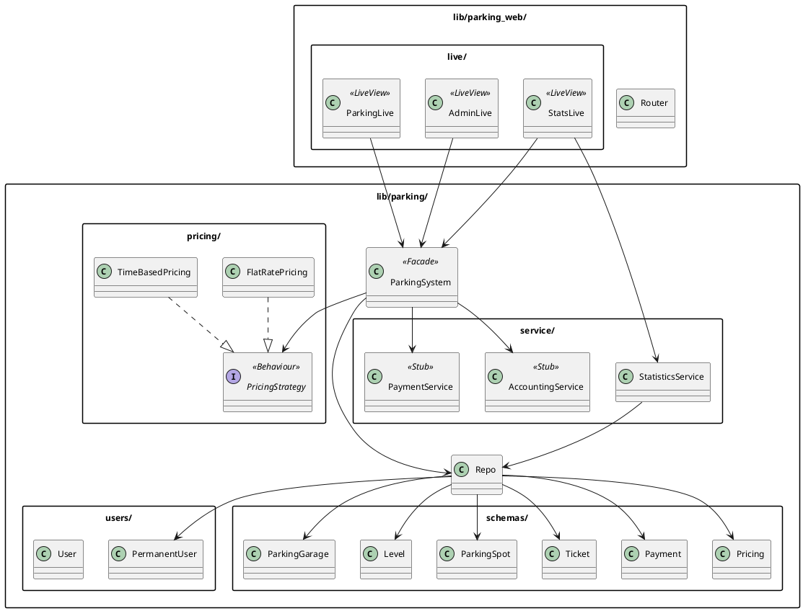
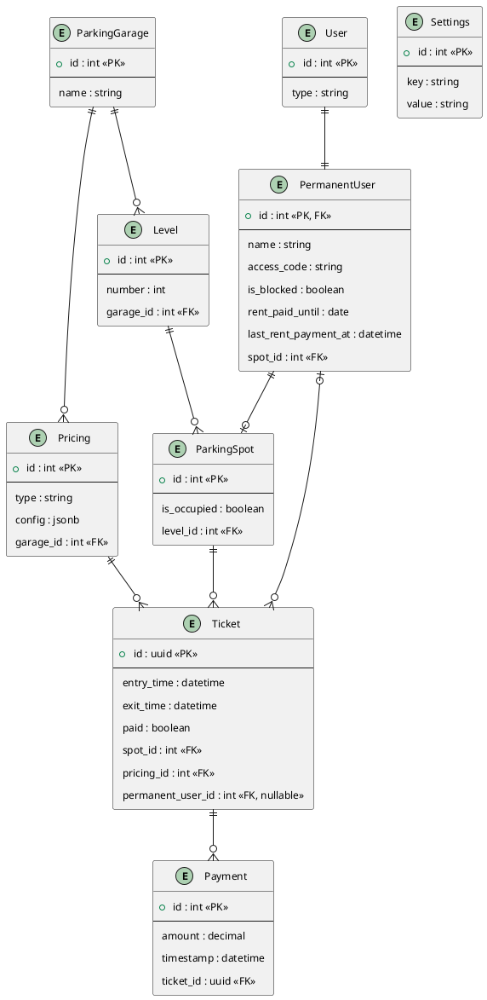

# Parkhaus-Verwaltungssoftware
### Semesterarbeit Software Engineering

Adrian Aeschlimann · TEKO Schweizerische Fachschule · Mai 2026

---

## Ausgangslage

- EasyParking AG: mehrere Parkhäuser, veraltete Software
- Keine geeignete Standardlösung gefunden
- **Ziel:** Lastenheft + funktionsfähiger Prototyp

---

## Zwei Nutzertypen

| | Gelegenheitsnutzer | Dauermieter |
|---|---|---|
| Einfahrt | Ticket erhalten | Code eingeben |
| Parkplatz | Automatisch zugewiesen | Fixer Platz |
| Bezahlung | Vor Ausfahrt | Monatliche Miete |
| Ausfahrt | Austrittsticket scannen | Code eingeben |

---

## Technologie-Stack

- **Elixir / Phoenix / LiveView** — serverseitige UI, kein JS-Framework
- **PostgreSQL** + Ecto — relationale Datenhaltung
- **BEAM** — Nebenläufigkeit und Stabilität

Motivation: neue Technologie im Rahmen der Arbeit kennenlernen

---

## Architektur



---

## Preisberechnung — Strategy Pattern

```
PricingStrategy (Behaviour)
├── TimeBasedPricing   ← Viertelstundentarif, Zeit-/Wochenend-/Feiertagsslots
└── FlatRatePricing    ← Einfache Tagespauschale
```

- Viertelstundenabrechnung (Tarif zu Beginn gilt für ganze Viertelstunde)
- Separate Slots für Wochenende und Feiertage
- Ab 24 Stunden → Tagespauschale CHF 35.00

---

## Benutzeroberfläche

| Ansicht | Funktion |
|---|---|
| Parkhaus-Ansicht | Einfahrt, Bezahlung, Ausfahrt — für beide Nutzertypen |
| Admin | Dauermieter verwalten, Miete buchen, Sperrstatus |
| Statistik | Monats-/Jahresumsatz nach Kundenkategorie |

→ Live-Demo

---

## Datenbank



---

## Tests

18 Testfälle · ExUnit · alle bestanden

| Kategorie | Testfälle |
|---|---|
| Einfahrt & Parkplatzzuweisung | TC-01, TC-02 |
| Preisberechnung | TC-03 – TC-06 |
| Dauermieter & Authentifizierung | TC-07, TC-08 |
| Bezahlung & Ausfahrt | TC-09 – TC-12 |
| Statistiken | TC-13, TC-14 |
| Nicht-funktionale Anforderungen | TC-15 – TC-18 |

---

## Fazit

**Erreicht:**
- Vollständiger Parkierungsprozess für beide Nutzertypen
- Konfigurierbare Preisberechnung mit Strategy Pattern
- Admin-Dashboard und Statistikauswertung
- 18 Testfälle bestanden

**Learnings:**
- LiveView vereinfacht serverseitige UI erheblich
- BEAM-Ökosystem: robuste Grundlage für Prototyp

---

## Demo
